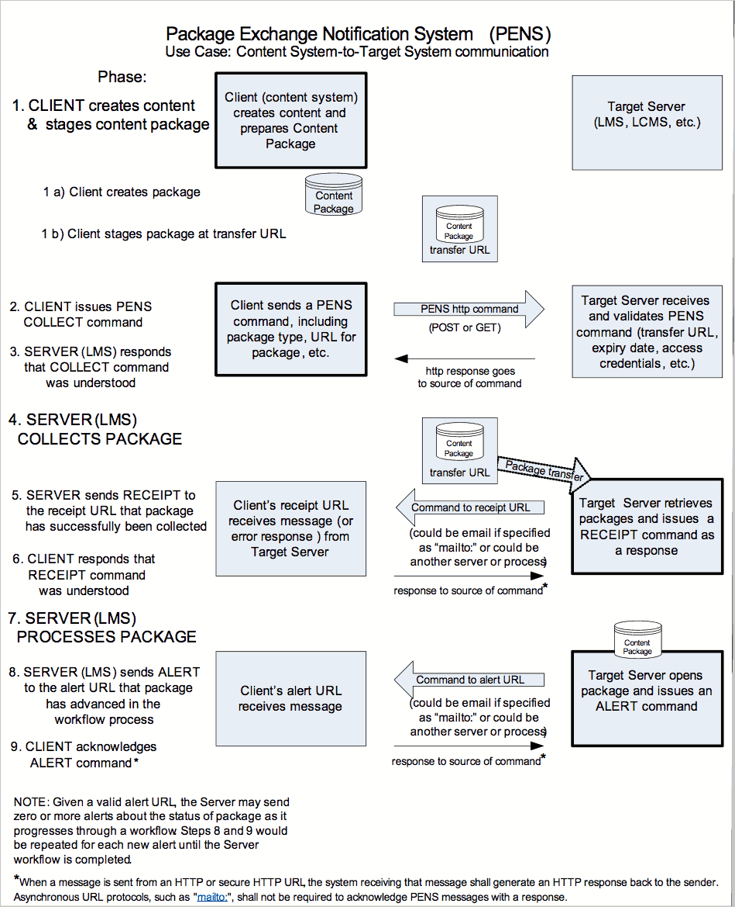

11 October 2016
PENS v2.0.0 _**DRAFT**_

DOCUMENT No. CMI010

# Guidelines for Package Exchange Notification Services

    VERSION 2.0.0
     _Proposed_ RELEASE DATE 2017-March-15
    Based on Revision 1.0a released 2006-March-15

FORMATTING NOTES:

This document is formatted using
[Markdown](http://daringfireball.net/projects/markdown/). The document relies
on features of GitHub Flavored Markdown ("GFM") as described at:
<https://guides.github.com/features/mastering-markdown/#GitHub-flavored-markdown>.
For the most accurate rendering and to avoid potential misinterpretations due
to formatting discrepancies, please view the documentation on GitHub or use a
rendering engine supporting GFM.

THIS DOCUMENT IS CONTROLLED BY:

    cmi5 Workgroup, as successor to AICC CMI Subcommittee

    ALL REVISIONS SHALL BE APPROVED BY THE ABOVE ORGANIZATION PRIOR TO RELEASE.

POINT OF CONTACT:

Tom King
cmi5 PENS Workgroup Lead
<tking@onpointlearning.com>

FILED UNDER: <https://github.com/AICC/PENS_Spec_Current>

---

## Specification for Learning Technology—  Package Exchange Notification Services (PENS)

### Abstract

This specification describes a protocol to support a notification service to
announce the location of content package(s) that are available for transport.
The intent is to automate the notification, transfer and delivery confirmation
of content packages between tools or systems that generate content and systems
that manage, publish or deliver content. The scope of the specification is
specifically constrained to the notification request, package transfer and
related responses. Specifically outside the scope of this specification are
mechanisms for physical deployment of content packages, content management,
version control, publication or revocation of content.

#### Keywords

CBT, CMI, cmi5, CMS, cmi5, content management, content package, e-learning,
LCMS, LMS, notification service, package exchange, PENS, SCORM, xAPI.

#### Revision Notes

The PEN 2.0.0 revision focuses on four goals:

1. **Package format updates**: The addition of contemporary package formats
such as xAPI and cmi5.
2. **Batch or multi-package processing**: Streamlining for the transfer and
notification processing of multiple packages.
3. **Permissions and security**: More contemporary approaches to permissions,
such as OAuth. Explicitly indicated preference for HTTPS in lieu of HTTP, and
for SFTP in lieu of FTP.
4. **Mobile-enabled alerts and notifications**: Enabling modern mobile alerts
and notifications such as SMS, Apple Push Notification Services (APNS),
Firebase Cloud Messaging (FCM), and Google Cloud Messaging (GCM).

### Introduction

The purpose of this specification is to fill a gap that currently exists
between the creation of content packages by "content authors" and the
deployment of those content packages on LMSs by "LMS administrators" where
learners may ultimately have access to them. Without a specification that
addresses this gap, the concept of shared content is incomplete: LMSs do not
have a means to obtain newly developed, revised or updated content.

This specification aims to provide a mechanism whereby content that is capable
of being shared can be deployed and thus actually shared in practice. It
describes a notification scheme that will enable a content creator's authoring
system to announce that a content package is available and ready for transport
from a location that it will provide.

The acronym for this specification is PENS: Package Exchange Notification
Services. The PENS data model may be extended in the future to include commands
in addition to the current `collect` command, which is the first service to be
defined. Data elements and value spaces can be extended as driven by needs and
determined in the future by the community of users.

The scope of the specification is specifically constrained to the notification
request, package transfer and related responses. PENS addresses neither version
control nor content management; there are no PENS commands to require the
recipient to remove, replace, or update existing packages or elements of
packages. PENS provides a contact URI (e.g., email address) for the recipient
to contact the requestor, but PENS does not prescribe a specific workflow for
processing of the transferred package. PENS does not require notifications to
the requestor, other than the specific obligatory confirmation. For
illustrative purposes, consider a courier service as a conceptual model for
PENS. Two parties may use the courier service as a means The purpose of this
specification is to fill a gap that currently exists between the creation of
content packages by "content authors" and the deployment of those content
packages on LMSs by "LMS administrators" where learners may ultimately have
access to them. Without a specification that addresses this gap, the concept of
shared content is incomplete: LMSs do not have a means to obtain newly
developed, revised or updated content.

The purpose of this specification is to fill a gap that currently exists
between the creation of content packages by "content authors" and the
deployment of those content packages on LMSs by "LMS administrators" where
learners may ultimately have access to them. Without a specification that
addresses this gap, the concept of shared content is incomplete: LMSs do not
have a means to obtain newly developed, revised or updated content.

This specification aims to provide a mechanism whereby content that is capable
of being shared can be deployed and thus actually shared in practice. It
describes a notification scheme that will enable a content creator's authoring
system to announce that a content package is available and ready for transport
from a location that it will provide.

The acronym for this specification is PENS: Package Exchange Notification
Services. The PENS data model may be extended in the future to include commands
in addition to the current `collect` command, which is the first service to be
defined. Data elements and value spaces can be extended as driven by needs and
determined in the future by the community of users.

The scope of the specification is specifically constrained to the notification
request, package transfer and related responses. PENS addresses neither version
control nor content management; there are no PENS commands to require the
recipient to remove, replace, or update existing packages or elements of
packages. PENS provides a contact URI (e.g., email address) for the recipient
to contact the requestor, but PENS does not prescribe a specific workflow for
processing of the transferred package. PENS does not require notifications to
the requestor, other than the specific obligatory confirmation. For
illustrative purposes, consider a courier service as a conceptual model for
PENS. Two parties may use the courier service as a means of requesting pick-up,
performing transfer, and confirming delivery. However, it is not incumbent on
the courier to enforce particular post-processing by the recipient. The
recipient may decide to use the parcel as notification to remove something, add
the parcel to stock, or replace existing stock. All post-delivery processing is
determined by the recipient. The recipient sets its own policy and procedures,
and may choose to notify the party that requested delivery of specific events
as it sees fit to do.

### Discussion forum

The PENS working group communicates via the Github repository. To view
PENS-related documents and comment on them, go to:

<https://github.com/AICC/PENS_Spec_Current>

### Charter Contributors and Organizations

* Tom King (OnPoint Digital)
* Paul Schneider (domiKnow Learning)

---

## Specification for Learning Technology— Package Exchange Notification Services

### 1. Overview

The scope and purpose of this specification are discussed in 1.1 and 1.2.
This specification describes a protocol to announce the location of content
package(s) that are available for transport. The intent is to automate the
notification, transfer and delivery confirmation of content packages between
tools or systems that generate content and systems that manage, publish or
deliver content.

#### 1.1 Scope

This specification describes a data model and binding to facilitate the
transport of e-learning content between content publishing systems and systems
for the delivery of e-learning such as a learning management system (LMS). This
specification describes a notification scheme that is a communication between
the content publishing (or authoring) system and the server managing delivery.
It includes data elements to identify the package format and location. The
specification does not specify how the systems must behave after the package is
transferred. The scope is specifically constrained to the notification request,
package transfer and related responses. Specifically outside the scope of this
specification are mechanisms for deployment of content packages, content
management, version control, publication or revocation of content. The
specification does not provide any mechanism for systems to search for content
packages. This specification relies on content package formats specified by the
Advanced Distributed Learning (ADL) Initiative and the AICC; the definition of
content package formats is outside the scope of this specification. The binding
in Appendix A is modeled on AICC HACP mechanisms as defined in the AICC data
model for Computer Managed Instruction (CMI).

#### 1.2 Purpose

The purpose of this specification is to provide a means to notify targeted
systems of the existence of content packages that may be of interest to those
systems. The notification scheme defines the format of the message that
describes the available content package and from where it can be retrieved. The
intent is to simplify content authoring and deployment by supporting automation
of the transfer of e-learning content between authoring or publishing systems
and systems for managing or deploying content.

---

### 2. References

The following referenced documents are indispensable for the application of
this specification. For dated references, only the edition cited applies. For
undated references, the latest edition of the referenced document (including
any amendments) applies.

RFC 1738, "Uniform Resource Locators (URL)," December 1994.
RFC 2368, "The mailto URL scheme," July 1998.
RFC 2396, "Uniform Resource Identifiers (URI): Generic Syntax," August 1998.
RFC 2616, "Hypertext Transfer Protocol -- HTTP/1.1," June 1999.
RFC 2817, "Upgrading to TLS Within HTTP/1.1," May 2000.
RFC 2822, "Internet Message Format," April 2001.
ISO 8601:2000 "Data elements and interchange formats -- Information interchange
-- Representation of dates and times," Edition 2.

---

### 3. Definitions

For purposes of this specification, the following terms and definitions apply.
The AICC Glossary [A3], should be referenced for terms not defined here.

#### Content Package

The data structures and files used to provide interoperability of digital
e-learning material with authoring tools, LMS products and run-time
environments. A content package typically contains one or more files that list
all of the resources included in the package; data to describe the content
structure; data describing prerequisite or sequencing rules, descriptive
metadata, and the supporting files (and/or pointers to external resources) that
constitute the e-learning material. Often the components of a content package
are combined into a single-file archive format such as a PKZip v2.04g,
conformant to RFC1951.

#### Client (Sending) System

A system that initiates a PENS request and ensures that a conformant content
package is available for delivery. Examples of Client Systems include Authoring
Tools, Learning Content Management Systems, Content Management Systems,
Middleware Systems, Assessment Systems and other systems that can publish
content.

#### Learning Content Management System (LCMS)

A computer system that includes and combines the functions of a Content
Repository or Content Management System and a Learning Management System. The
Content Repository functions manage the content and permit locating stored
content, authoring new content, attaching metadata to content, managing
versions of content, etc. The Learning Management System functions administer
courses to learners.

#### Learning Management System (LMS)

A computer system that may include the capabilities to register learners,
schedule learning resources, control and guide the learning process, analyze
and report learner performance, and schedule and track learners.

#### Target (Receiving) System

A system that receives PENS requests and is responsible for the transfer and
import of content packages. The target system is also responsible for validating
responses, returning error messages and delivering receipts and alerts.
Examples of Target Systems include Learning Management Systems, Learning
Content Management Systems, Content Management Systems, Content Repositories,
Middleware and any other system that can import content for the purpose of
managing or delivering content.

#### 3.1 Abbreviations and acronyms

AICC:  Aviation Industry CBT Committee

CBT: Computer-Based Training

CMI:  Computer Managed Instruction

CMS:  Content Management System

HACP:  HTTP AICC Communication Protocol

LCMS:  Learning Content Management System

LMS:  Learning Management System

PENS:  Package Exchange Notification Services

QTI:  Question and Test Interoperability

SCORM:  Sharable Content Object Reference Model

URI:  Uniform Resource Identifier

URL:  Uniform Resource Locator

URN:  Uniform Resource Name

---

### 4. Conformance

Conformance to this specification is discussed in 4.1 – 4.3.

In this specification, "shall" is to be interpreted as a requirement on an
implementation; "shall not" is to be interpreted as a prohibition.

### 4.1 Sending implementations (Client Systems)

A conforming sending implementation shall send data instances that conform to
this specification and accept responses from target systems as defined in this
specification. A conforming sending implementation shall send all required
elements

### 4.2 Receiving implementations (Target Systems)

A conforming receiving implementation shall accept data instances that conform
to this specification and generate the required, valid responses. Data
instances that conform to this specification include all required elements and
may include optional elements.

### 4.3 Implementation-defined values

The processing and meanings of values that are not specified by this
specification (e.g., sentinel, missing, and empty values) are
implementation-defined.

>NOTE:
>For example, implementations may specify the processing or meanings of
>missing, default values or sentinel values. A Target System implementation
>might specify that in the absence of another value, an empty password value
>indicates no password is required.

---

### 5. Conceptual Model: Informative

#### Synopsis of Package Exchange Notification Services (PENS) Model

* A notification is sent from a content source (such as an authoring tool, CMS
or LCMS) to a Target System (central deployment or repository system such as a
CMS, LCMS or LMS).
* The notification announces the availability and location of a content package
that is available for transport.
* The notification represents the first step in initiating the Target System
workflow to transfer and import a content package.

##### Notification Mechanism Details

* Suggested notification mechanism binding:  HTTP-GET or HTTP-POST of
name-value pairs (see Appendix A, "Binding of PENS Message to a URI").

>NOTE:
>According to RFC 2616 (June 1999), section 3.2.1, "The HTTP protocol does not
>place any a priori limit on the length of a URI. Servers MUST be able to
>handle the URI of any resource they serve, and SHOULD be able to handle URIs
>of unbounded length if they provide GET-based forms that could generate such
>URIs. A server SHOULD return 414 (Request-URI Too Long) status if a URI is
>longer than the server can handle. (Servers should be cautious about
>depending on URI lengths above 255 bytes, because some older client or proxy
>implementations may not properly support these lengths.)" Also see RFC 2817,
>Upgrading to TLS within HTTP/1.1, as an update to RFC 2616.
>The definitive reference for HTTP-GET and HTTP-POST is:
><http://www.w3.org/Protocols/Overview.html>

* Notification modes: can be server-to-server, or server via browser window to
server (HTTP-GET only).
* Responsibilities of sender: The content source (herein referred to as the
"Client") shall arrange for the content package to be made available on a
staging server. The Client shall be capable of specifying a URI that uses HTTP,
or HTTPS (secure HTTP) protocols. The Client may optionally support specifying
FTP and FTPS (secure FTP) protocols and the related access credentials.

>NOTE:
>It is assumed that the particular configuration of the staging server may be
>determined by a third party and therefore is not controlled by the content
>developer (Client). It is further assumed that if content is staged on the
>server via FTP that it does not have to be retrieved via FTP, but could be
>retrieved via an HTTP alias. Such provisions allow cases such as the transfer
>to the staging location via FTP and retrieval via an HTTP equivalent or alias
>to the same location.

* Password: If required by the Client's system, the notification may include a
password needed to access the content package.

##### Responsibilities of Recipient of Notification (Target System)

* The notification recipient (herein referred to as the "server") shall be
capable of supporting both HTTP and HTTPS protocols for the "pull" or "get"
transfer of the content package from the URI provided by the Client. The server
may optionally support the retrieval of packages specified with FTP or FTPS
protocols and appropriate access credentials. In such cases where the server
does not support one or more optional protocols, the server is obligated to
return the appropriate error message regarding the requested protocol.
* Once the content package is retrieved, store or deploy it (for example, make
available via a catalog of resources for a course).

##### Illustrative Use Case

A use case for this specification is shown in Figure 1.

* Client (authoring system) creates and prepares a content package.
* Client sends a PENS message to Target System (e.g., an LMS).
* Target System acknowledges PENS message.
* Target System collects and processes content package.



###### Figure 1— Conceptual model, Content System-to-Target System communication

#### 5.1 Description of use case

The diagram (Figure 1 above) illustrates the phases that need to occur between
a Client System and a Target System to issue and process a collect command that
transfers a content package.

##### Preparing the content package and issuing a PENS command

Assume a content author has created some learning content. A content package
has been prepared and staged by the Client (the authoring system) at a transfer
URL (an HTTP site or FTP site) from where it can be collected. The Target
System that may ultimately retrieve the client's content package is typically
a CMS, LMS or LCMS product.

>NOTE:
>The Client may use FTP or other mechanisms to transfer content to a staging
>location, yet specify an HTTP URI equivalent as the package-url for retrieval.
>There is no requirement that the retrieval protocol must match the method used
>to stage the content. Content staged on the server via FTP could be retrieved
>via an HTTP alias. Best practices indicate that HTTP is the preferred
>transport protocol for the package-url.

The Client System then sends a message that contains the PENS "collect" command
to the Target System (CMS, LMS, LCMS, etc.) via HTTPS. This Package Exchange
Notification Services (PENS) message includes the elements detailed in the
table in 6.2. These PENS elements provide information about the type of content
package, where it is available, how to communicate with the client and other
parameters. The vendor-data element is available for optional data defined by
the target system implementation. This implementation-specific data might be
used to provide information from the content provider about how a target system
is to act on a package after retrieval. Next, the Target System (e.g., LMS)
validates the PENS message (transfer URL, content package expiration date, any
required access credentials or passwords, etc.) and sends an HTTPS response back
to the Client System. (An HTTP error code is sent if there was a problem with
the PENS message. See 6.3, Response and Error Messages.) This response simply
acknowledges that the PENS collect command was understood; it does not imply
that processing to actually retrieve the package has commenced.

>NOTE:
>In another scenario, the Client System could open a browser window to send the
>PENS message, and the HTTP response from the Target System would be returned
>to there.

##### Collecting the content package

If a server receives a valid collect command, the server can attempt to
retrieve the package from the transfer URL via FTP, HTTP or HTTPS. (NOTE: per
best practices, HTTPS is the preferred protocol for package retrieval.) After
attempting to retrieve a package, the server sends a response to the specified
receipt URL, either acknowledging successful collection of the package or
reporting an error. Receipt responses can be sent to one or more email
addresses if so specified in the PENS message.

The format of the receipt message sent to the specified receipt URL is not
fully defined, but should include relevant data from the inbound Collect
Command, such as the package type, package id, and client, plus the receipt
message itself.

If an error has occurred, an error message should be sent to the receipt URL.
The `pens-data` portion of the error message could include extended information
about the nature of the error (such as a stack trace of what happened during
the attempted communication). See Section 6.3 Response and Error Messages for
details.

##### Opening and deploying a content package

The recipient system will proceed with internal processing, such as opening the
package, approving the content for release, listing the new content in a
catalog, staging the content on a deployment server, etc.

>NOTE:
>Internal processing phases, workflow and alert triggers are
>implementation-specific and are outside the scope of this specification.
>However, the ‘vendor-data' may supply useful hints from the content provider
>about how particular recipient systems are to act on the package subsequent to
>retrieval.

If an alert URL has been provided, the server may send alerts to the Client
about the status of the package as it progresses through these various
processes. For example, an "alert" message may be sent to the content authoring
management staff (the Client) so that where the retrieved content is being
cataloged, deployed, etc., can be monitored. Alerts can be sent to one or more
email addresses.

The format of the alert message(s) sent to the specified alert URL is not fully
defined, but should include relevant data from the inbound Collect Command,
such as the package type, package id, and client, plus the alert message
itself.

---

### 6. Data Model

This defines the PENS data model that enables the sending of a notification
message from authoring tools to target systems to announce the description and
location of content packages that are available for transfer.

This specification does not define which servers are notified, nor does it
define what happens to any package that has been retrieved.

The table below summarizes the components of the model, which are then defined
in the subsections indicated.

<!-- Table 1 - DATA MODEL -->
| Component            | Required | Data Type                                             | Sub-section |
| -------------------- | -------- | ----------------------------------------------------- | ----------- |
| target system URL    | Yes      | URL                                                   |             |
| pens-version         | Yes      | x.x.x (string of three integers separated by periods) | 6.2.1       |
| command              | Yes      | Reserved words, pre-defined character strings         | 6.2.2       |
| package-type         | Yes      | Reserved words, pre-defined character strings         | 6.2.3       |
| package-type-version | Yes      | Character string                                      | 6.2.4       |
| package-format       | Yes      | Character string                                      | 6.2.5       |
| package-id           | Yes      | A URI according to RFC 2396                           | 6.2.6       |
| package-url          | Yes      | URL, URL-encoded string                               | 6.2.7       |
| package-url-user-id  | No       | Character string                                      | 6.2.8       |
| package-url-account  | No       | Character string                                      | 6.2.9       |
| package-url-password | No       | Character string                                      | 6.2.10      |
| package-url-expiry   | Yes      | ISO 8601 format expressed as UTC                      | 6.2.11      |
| client               | Yes      | Character string                                      | 6.2.12      |
| system-user-id       | No       | Character string                                      | 6.2.13      |
| system-password      | No       | Character string                                      | 6.2.14      |
| receipt              | Yes      | Character string                                      | 6.2.15      |
| alerts               | No       | Character string                                      | 6.2.16      |
| vendor-data          | No       | Character string                                      | 6.2.17      |

ASSUMPTIONS/NOTES:

>1. The authoring tool has a method for sending the messages/password to the
>target system URL; automatic discovery of the package by LMSs is out of scope.
>2. Messages/passwords are sent as clear text; encryption and security issues
>are out of scope.
>3. PENS message focuses on the transport and overall package type.
>4. Receiving system sends an HTTP acknowledgement of message receipt.
>5. After a package transfer is achieved, receiver responds with an
>acknowledgement or an error message to a receipt URI.
>6. How the package is processed upon retrieval is left to the Target System
>implementation. Notifications of processing errors or events shall be sent to
>the alert URI.
>7. Acknowledgment and Error responses shall be in the format specified in 6.3,
>Response and Error Messages. (Format is similar to AICC HACP error responses.)
>8. This specification does not define an extension mechanism for the data
>model. Implementers may create additional data models for package exchange
>notification. Such models may be used to augment this model to support
>different communities of practice.

#### 6.1 Target system for PENS message

This is a sample URL for a system that might receive and process a valid PENS
command.

##### target system URL

<!-- Table 2 - target system URL -->
| target system URL        | Information                                                                                 |
| ------------------------ | ------------------------------------------------------------------------------------------- |
| **Required**: Yes        | **Description**: Fully qualified URL of target system that will perform processing.         |
| **Data type**: URL       | **Value space**: Valid, fully qualified URI, including transport protocol (e.g., `http://`) |
| <!-- empty by intent --> | **Example**: `http://acmelearning.lms.com`                                                  |

#### 6.2 PENS message elements

##### _Reserved words_

The following words are not utilized in this version of PENS, but are reserved
for use in subsequent versions as potential candidates for PENS commands.

* Delete
* Revise

##### pens-version

<!-- Table 3 - pens-version -->
| pens-version                                                         | Information                                                                                                       |
| -------------------------------------------------------------------- | ----------------------------------------------------------------------------------------------------------------- |
| **Required**: Yes                                                    | **Description**: Version of package exchange notification service protocol used by client submitting the package. |
| **Data type**: x.x.x (string of three integers separated by periods) | **Value space**: Values defined by releases of the specification                                                  |
| <!-- empty by intent -->                                             | **Sample element value**: `2.0.0`                                                                                 |

##### command

<!-- Table 4 - command -->
| command                                                      | Information                                                                                                                                                                                                                    |
| ------------------------------------------------------------ | ------------------------------------------------------------------------------------------------------------------------------------------------------------------------------------------------------------------------------ |
| **Required**: Yes                                            | **Description**: Command for an action that client submitting the package is requesting for the target system to perform. May include the capability to perform a preview of the content in the system's run-time environment. |
| **Data type**: Reserved words, pre-defined character strings | **Value space**: Fixed values defined by specification.                                                                                                                                                                        |
| <!-- empty by intent -->                                     | **Vocabulary**: At this time only "collect" is defined. See 6.2 for reserved words.                                                                                                                                            |
| <!-- empty by intent -->                                     | `collect`: To retrieve a content package from a designated server.                                                                                                                                                             |
| <!-- empty by intent -->                                     | **Sample element value**: `collect`                                                                                                                                                                                            |

##### package-type

<!-- Table 5 - package-type -->
| package-type                                                 | Information                                                                                                                         |
| ------------------------------------------------------------ | ----------------------------------------------------------------------------------------------------------------------------------- |
| **Required**: Yes                                            | **Description**: Allowable types of content packages. Other types: AICC assignable unit (`aicc-au`) or SCORM package (`scorm-pif`). |
| **Data type**: Reserved words, pre-defined character strings | **Value space**: Fixed values defined by specification.                                                                             |
| <!-- empty by intent -->                                     | **Vocabulary**:<br>aicc-pkg<br>scorm-pif<br>lms-qti                                                                                 |
| <!-- empty by intent -->                                     | **Sample element value**: `aicc-pkg`                                                                                                |

##### package-type-version

<!-- Table 6 - package-type-version -->
| package-type-version            | Information                                                                                                                                                                                    |
| ------------------------------- | ---------------------------------------------------------------------------------------------------------------------------------------------------------------------------------------------- |
| **Required**: Yes               | **Description**: Identifies the version of the packaging specification relevant for the package to be processed, e.g., for ADL SCORM `scorm-pif` packages, a system might use `1.2` or `2004`. |
| **Data type**: Character string | **Value space**: Values defined by associated package spec releases, such as ADL SCORM, AICC CMI, or IMS QTI specifications.                                                                   |
| <!-- empty by intent -->        | **Sample element value**: `1.0`                                                                                                                                                                |

##### package-format

<!-- Table 7 - package-format -->
| package-format                  | Information                                                                                                                                  |
| ------------------------------- | -------------------------------------------------------------------------------------------------------------------------------------------- |
| **Required**: Yes               | **Description**: Identifies a package as being one of the allowable package archive formats or resource types.                               |
| **Data type**: Character string | **Value space**: Values defined by package archive format or resource types. Reserved values include: `zip`, `url`, `jar`, `war`, and `xml`. |
| <!-- empty by intent -->        | **Sample element value**: `zip`                                                                                                              |

##### package-id

<!-- Table 8 - package-id -->
| package-id                                 | Information                                                                                                                                                                                                                                                             |
| ------------------------------------------ | ----------------------------------------------------------------------------------------------------------------------------------------------------------------------------------------------------------------------------------------------------------------------- |
| **Required**: Yes                          | **Description**: Unique identifier required for package; package-id shall be a URI consisting of two parts, a globally unique namespace taken from the URL associated with the product or the service generating the ID plus an ID unique within the service itself.    |
| **Data type**: A URI according to RFC 2396 | **Value space**: Any URI according to RFC 2396 with the additional requirement that the URI shall be constructed such that its namespace is the URL associated with the product or service generating the ID and the id of the package is unique within that namespace. |
| <!-- empty by intent -->                   | **Sample element value**: `http://myurl.com:2631e419-1573-4720-b4c6-8701f960dccc`                                                                                                                                                                                       |

##### package-url

<!-- Table 9 - package-url -->
| package-url                            | Information                                                                                                                               |
| -------------------------------------- | ----------------------------------------------------------------------------------------------------------------------------------------- |
| **Required**: Yes                      | **Description**: Location of package archive ready for transfer/action.                                                                   |
| **Data type**: URL, URL-encoded string | **Value space**: Valid, fully qualified URL, including transport protocol (e.g., `http://` or `ftp://`) and filename including extension. |
| <!-- empty by intent -->               | **Sample element value**: `http://myauthoringtool/mycontentpackage.zip`                                                                   |

##### package-url-user-id

<!-- Table 10 - package-url-user-id -->
| package-url-user-id             | Information                                                                |
| ------------------------------- | -------------------------------------------------------------------------- |
| **Required**: No                | **Description**: User id required for system to retrieve package from URL. |
| **Data type**: Character string | **Value space**: Null string or character string.                          |
| <!-- empty by intent -->        | **Sample element value**: (null string)                                    |

##### package-url-account

<!-- Table 11 - package-url-account -->
| package-url-account             | Information                                                                |
| ------------------------------- | -------------------------------------------------------------------------- |
| **Required**: No                | **Description**: Account required for system to retrieve package from URL. |
| **Data type**: Character string | **Value space**: Null string or character string.                          |
| <!-- empty by intent -->        | **Sample element value**: (null string)                                    |

##### package-url-password

<!-- Table 12 - package-url-password -->
| package-url-password            | Information                                                                 |
| ------------------------------- | --------------------------------------------------------------------------- |
| **Required**: No                | **Description**: Password required for system to retrieve package from URL. |
| **Data type**: Character string | **Value space**: Null string or character string.                           |
| <!-- empty by intent -->        | **Sample element value**: (null string)                                     |

##### package-url-expiry

<!-- Table 13 - package-url-expiry -->
| package-url-expiry                              | Information                                                                                                         |
| ----------------------------------------------- | ------------------------------------------------------------------------------------------------------------------- |
| **Required**: Yes                               | **Description**: The package is expected to be available for processing until at least the date and time specified. |
| **Data type**: ISO 8601 format expressed as UTC | **Value space**: Null string or character string.                                                                   |
| <!-- empty by intent -->                        | **Sample element value**: `2016-07-24T02:51:29`                                                                     |

##### client

<!-- Table 14 - client -->
| client                          | Information                                                                                                                                  |
| ------------------------------- | -------------------------------------------------------------------------------------------------------------------------------------------- |
| **Required**: Yes               | **Description**: Name or ID for client submitting the content package to the target system. Other examples: `PerceptionForWeb`; `Captivate`. |
| **Data type**: Character string | **Value space**: Null string or character string.                                                                                            |
| <!-- empty by intent -->        | **Sample element value**: `Storyline2`                                                                                                       |

##### system-user-id

<!-- Table 15 - system-user-id -->
| system-user-id                  | Information                                                              |
| ------------------------------- | ------------------------------------------------------------------------ |
| **Required**: No                | **Description**: User id or sign-on for target system, or a null string. |
| **Data type**: Character string | **Value space**: Null string or character string.                        |
| <!-- empty by intent -->        | **Sample element value**: `tk007`                                        |

##### system-password

<!-- Table 16 - system-password -->
| system-password                 | Information                                                                                                                                                                                                                                  |
| ------------------------------- | -------------------------------------------------------------------------------------------------------------------------------------------------------------------------------------------------------------------------------------------- |
| **Required**: No                | **Description**: Either a URL-encoded password token or the null string. If the target system requires a password and the null string value is passed, then the target system is responsible for prompting for a password for target system. |
| **Data type**: Character string | **Value space**: Null string or character string.                                                                                                                                                                                            |
| <!-- empty by intent -->        | **Sample element value**: (null string)                                                                                                                                                                                                      |

##### receipt

<!-- Table 17 - receipt -->
| receipt                         | Information                                                                                                                                                                                                    |
| ------------------------------- | -------------------------------------------------------------------------------------------------------------------------------------------------------------------------------------------------------------- |
| **Required**: Yes               | **Description**: URL to send acknowledgement receipt after collecting a package; if `mailto:` URL is used, it may include more than one address, with addresses separated by commas per RFC 2368 and RFC 2822. |
| **Data type**: Character string | **Value space**: Any URL, including `mailto:` URL scheme per RFC 2368 and RFC 2822.                                                                                                                            |
| <!-- empty by intent -->        | **Sample element value**: `mailto:name@domain.com`                                                                                                                                                             |

##### alerts

<!-- Table 18 - alerts -->
| alerts                          | Information                                                                                                                                                                                                                                                                                                            |
| ------------------------------- | ---------------------------------------------------------------------------------------------------------------------------------------------------------------------------------------------------------------------------------------------------------------------------------------------------------------------- |
| **Required**: No                | **Description**: URL to send alerts to while processing the package (after the acknowledgment to `receipt` URL). If the alert URL is a `mailto:` URL, it may include more than one address, with addresses separated by commas per RFC 2368 and RFC 2822. The alert response format is the same as that for `receipt`. |
| **Data type**: Character string | NOTE: Unlike the receipt URL, `alerts` is optional and multiple messages may be sent to the alert URL over an extended period as the package is processed through the host workflow.                                                                                                                                   |
| <!-- empty by intent -->        | **Value space**: Any URL, including `mailto:` URL scheme per RFC 2368 and RFC 2822.                                                                                                                                                                                                                                    |
| <!-- empty by intent -->        | **Sample element value**: `mailto:name@domain.com`                                                                                                                                                                                                                                                                     |

##### vendor-data

<!-- Table 19 - vendor-data -->
| vendor-data                     | Information                                                                                                                                                                                                                                                                                                                                                                                  |
| ------------------------------- | -------------------------------------------------------------------------------------------------------------------------------------------------------------------------------------------------------------------------------------------------------------------------------------------------------------------------------------------------------------------------------------------- |
| **Required**: No                | **Description**: Unstructured character string that may be used to transfer vendor-specific data such as processing hints or deployment information.                                                                                                                                                                                                                                         |
| **Data type**: Character string | NOTE: Conforming implementations of target systems shall be capable of processing valid PENS commands containing this element, regardless of the system's ability to parse or act on the value. The value of this element is likely to be unique across implementations. PENS `alerts` are the mechanism for systems to provide acknowledgements or warnings regarding `vendor-data` values. |
| <!-- empty by intent -->        | **Value space**: Null string or character string, Smallest Permitted Maximum, 4096 characters                                                                                                                                                                                                                                                                                                |
| <!-- empty by intent -->        | NOTE: Size may increase if URL-encoding is a requirement of a particular binding.                                                                                                                                                                                                                                                                                                            |
| <!-- empty by intent -->        | **Sample element value**: (null string)                                                                                                                                                                                                                                                                                                                                                      |

#### 6.2 Response and Error Messages

Various communication problems can occur between the client offering the
package and the potential receiving (collecting) systems. Responses and error
messages provide a means of acknowledge and communication of processing errors.

##### PENS Responses

The receipt and alert URI may use `http://` or `mailto:` protocols. If the HTTP
protocol is used, the system receiving the message shall respond with an HTTP
response. A response is not required for `mailto:` URI for either receipt or
alert.

Sample responses below are informative only and do not represent requirement
specifications. See Appendix A for URI binding information specifications.

###### _Sample HTTP response to COLLECT command:_

  ```text
error=0
error-text=collect command received and understood
version=1.0.0
pens-data=
  ```

###### _Sample HTTP response to RECEIPT command:_

  ```text
error=0
error-text=receipt command received and understood
version=1.0.0
pens-data=
  ```

###### _Sample HTTP response to ALERT command:_

  ```text
error=0
error-text=alert command received and understood
version=1.0.0
pens-data=
  ```

##### PENS Error Messages

An error code shall be used to acknowledge successful processing or to indicate
a processing error. In the case of a processing error, the error code shall
indicate the class of error as specifically as possible using either a PENS
specific error code or an error code from the underlying protocol, as indicated
in table1, table 2, and table 3 below. The binding specification for error code
communication is in Appendix A.

<!-- Table 20 — "Response Error Codes" -->
| Code Number | Error Text                                            |
| ----------- | ----------------------------------------------------- |
| 0           | No error, successful                                  |
| other       | See error as listed in Table 3 - Specific Error Codes |

Error codes are integers represented as character strings, in the range of 0 to
65,535. Unspecified error codes in the range of 0 to 10000 are reserved for
use in future editions of the PENS specification. Error codes with numbers
10000 and above are reserved for implementation-defined error messages.

>NOTE:
>The error code numbering scheme was established such that PENS codes start at
>1000 to avoid collision with established error codes for underlying protocols
>(such as 400 series HTTP error codes). These underlying codes shall be used
>when they are indicative of the error encountered.

<!-- insert "Table 21 — Classification of Error Codes" here -->
| Range        | Error Type                                    |
| ------------ | --------------------------------------------- |
| 100 to 200   |                                               |
| 200 to 500   | Underlying protocol errors, e.g., HTTP errors |
| 1000 to 1199 | General PENS errors                           |
| 1200 to 1299 | PENS syntax errors                            |
| 1300 to 1399 | PENS transport errors                         |
| 1400 to 1499 | Host system errors                            |
| 1500 to 1599 | Acknowledgement and Alert errors              |
| 2000 to 9999 | PENS parameter errors                         |

Rationale: Errors are listed in increasing specificity; systems are to respond
with highest numbered error encountered. Error codes designated as warnings may
allow some degree of package processing (may not be fatal errors).

<!-- insert "Table 22— PENS-Specific Error Codes" here -->
| Code Number | Name                                      | Descriptive Text                                                                                                             |
| ----------- | ----------------------------------------- | ---------------------------------------------------------------------------------------------------------------------------- |
| 1101        | General error                             | Unable to parse PENS command                                                                                                 |
|             |                                           |                                                                                                                              |
| 1201        | General argument error                    | Attempt to pass an invalid argument                                                                                          |
|             |                                           |                                                                                                                              |
| 1301        | General retrieve error                    | Unable to retrieve package                                                                                                   |
| 1302        | Secure HTTP protocol not supported        | Unable to retrieve package via HTTPS                                                                                         |
| 1304        | FTP protocol not supported                | Unable to retrieve package via FTP                                                                                           |
| 1306        | Secure FTP protocol not supported         | Unable to retrieve package via FTPS                                                                                          |
| 1310        | Invalid or unresponsive package URL       | Unable to retrieve package at specified URL due to error in URL or lack of response from URL                                 |
| 1312        | Invalid package access credentials        | Unable to retrieve package at specified URL due to error with access credential for package URL                              |
| 1320        | Warning - invalid expiry date             | Expiration date is non-null and in an improper format                                                                        |
| 1322        | Warning - expired package                 | Current time indicates expiry date has passed                                                                                |
|             |                                           |                                                                                                                              |
| 1420        | PENS version not supported                | Insufficient permission                                                                                                      |
| 1421        | Command not supported                     | Client has requested host to execute an invalid, unknown or unsupported command                                              |
| 1430        | Package type not supported                | Client has requested host to process an invalid, unknown or unsupported package type                                         |
| 1432        | Internal package error                    | Host unable to process package after successfully retrieving it because of an error with package archive or package contents |
| 1440        | Insufficient host space/storage available | Host unable to process package due to local storage space or account restrictions                                            |
|             |                                           |                                                                                                                              |
| 1500        | General acknowledgment error              | Unable to communicate with provided acknowledgement URL                                                                      |
| 1510        | Unsupported acknowledgement protocol      | Unsupported acknowledgement protocol                                                                                         |
| 1520        | Unsupported alert protocol                | Unsupported alert protocol                                                                                                   |
|             |                                           |                                                                                                                              |
| 2001        | pens-version parameter missing            | Message incomplete; PENS version invalid or not specified                                                                    |
| 2002        | command parameter missing                 | Message incomplete; PENS command invalid or not specified                                                                    |
| 2003        | package-type parameter missing            | Message incomplete; package-type invalid or not specified                                                                    |
| 2004        | package-type-version parameter missing    | Message incomplete; package-type-version invalid or not specified                                                            |
| 2005        | package-format parameter missing          | Message incomplete; package-format invalid or not specified                                                                  |
| 2007        | package-id parameter missing              | Message incomplete; package-id invalid or not specified                                                                      |
| 2008        | package-url parameter missing             | Message incomplete; package-url invalid or not specified                                                                     |
| 2009        | package-url-expiry parameter missing      | Message incomplete; package-url-expiry date invalid or not specified                                                         |
| 2010        | client parameter missing                  | Message incomplete; client submitting package invalid or not specified                                                       |
| 2011        | receipt parameter missing                 | Message incomplete; where to send response invalid or not specified                                                          |

---

## Appendix A:  Binding of PENS to a URI

### 1. Binding of PENS Message to a URI

The PENS message shall be a valid URI [RFC 1738 and RFC 2396].

The URI shall consist of 4 components, as described in RFC 2396,

`<scheme>://<authority><path>?<query>`

The target system URL from the PENS data model (6.1) shall be used to create
the `<scheme>`, `<authority>` and `<path>` portions of the URI.

This portion of the URI shall be followed by the ASCII character "?" to
indicate the start of the `<query>` component of the URI, as per RFC 2396.

The query component of the URI shall be an unordered list of message elements.

Each element shall contain an element name, as specified in 6.2, followed by
the ASCII character "=" followed by the value for the message element. The
value for the message element shall be the lexical character encoding of the
value from the value space for the elements defined in 6.2. Message elements
shall be separated by the ASCII character "&".

* query = message element * ("&" message element)
* message element = pens element name "=" lexical element value

The entire URI shall be URI-encoded as per RFC 1738 and RFC 2396. Examples of
message element values, properly URI-encoded, are shown in the table below.

<!-- insert "Table #23 A-1 — Examples of Binding of Individual PENS Message Elements" here -->
| PENS Message Element Name | Example URI Binding                                                        | Sub-section |
| ------------------------- | -------------------------------------------------------------------------- | ----------- |
| `pens-version`            | `pens-version=1.0.0`                                                       | 6.2.1       |
| `command`                 | `command=collect`                                                          | 6.2.2       |
| `package-type`            | `package-type=aicc-pkg`                                                    | 6.2.3       |
| `package-type-version`    | `package-type-version=1.0`                                                 | 6.2.4       |
| `package-format`          | `package-format=zip`                                                       | 6.2.5       |
| `package-id`              | `package-id=http%3A%2F%2Fmyurl.com%3A2631e419-1573-4720-b4c6-8701f960dccc` | 6.2.6       |
| `package-url`             | `package-url=http%3A%2F%2Fmyauthoringtool%2Fmycontentpackage.zip`          | 6.2.7       |
| `package-url-user-id`     | `package-url-user-id=`                                                     | 6.2.8       |
| `package-url-account`     | `package-url-account=`                                                     | 6.2.9       |
| `package-url-password`    | `package-url-password=`                                                    | 6.2.10      |
| `package-url-expiry`      | `package-url-expiry=2005-07-22T06%3A51%3A29`                               | 6.2.11      |
| `client`                  | `client=Authorware7`                                                       | 6.2.12      |
| `system-user-id`          | `system-user-id=tk007`                                                     | 6.2.13      |
| `system-password`         | `system-password=`                                                         | 6.2.14      |
| `receipt`                 | `receipt=mailto%3Aname%40domain.com`                                       | 6.2.15      |
| `alerts`                  | `alerts=mailto%3Aname%40domain.com`                                        | 6.2.16      |
| `vendor-data`             | `vendor-data=preview-mode%3Ainstructor`                                    | 6.2.17      |

>NOTE:
>For the URI binding, the best practice is to use HTTP POST to issue the PENS
>message. Use of POST avoids a potential issue with two query separators (“?”)
>in the PENS message URI when the target system URL itself uses the format--
>`<scheme>://<authority><path>?<query>`
>(example: Target System URL is
>`http://acmelearning.lms.com?partition=staging1`).

&nbsp;

>NOTE:
>For cases when either the alert or the receipt value specifies the `mailto:`
>protocol the following best practice is recommended for the corresponding
>return command message in email format.
>
>1. Use a valid email address of an account associated with the system issuing
>the response for the sender and reply-to email addresses
>2. Use a suitable human-readable subject line for the email.
>3. Place any optional, implementation-specific information for the recipient
>in the body of the message before the PENS response data, Use a carriage
>return linefeed pair to separate this information from the PENS response data.
>4. Include all required data element names and the corresponding values of the
>PENS response in the body of the email. Preferred formatting is a data element
>name followed by "=" then the corresponding value with a carriage return line
>feed pair after the value.
>5. As indicated in Section 5.1, the format of the alert message is not fully
>defined, but should include relevant data from the inbound Collect Command,
>such as the package type, package id, and client, plus the alert message value
>itself.
>6. The email format is not fully defined. Implementers are encouraged to use
>the `https:` protocol for automated processing of inbound alerts and
>receipts; machine-based automated processing of inbound email is discouraged.

#### 1.1 Examples of PENS Messages Bound to a URI

In the examples that follow, line breaks are not significant; line breaks
appear only for readability.

##### Example Collect Command (*not* URL encoded, _for readability_)

  ```text
http://acmelearning.lms.com/pens?pens-version=1.0.0&command=collect
&package-type=aicc-pkg&package-type-version=1.0&package-format=zip
&package-id=http://myurl.com:2631e419-1573-4720-b4c6-8701f960dccc
&package-url=http:// myauthoringtool/mycontentpackage.zip
&package-url-user-id=&package-url-account=&package-url-password=
&package-url-expiry=2005-07-22T06:51:29&client=Authorware7
&system-user-id=tk007&system-password=&receipt=mailto:name@domain.com
&alerts=mailto:name@domain.com
  ```

###### Example of HTML link for collect command (_URL encoded_)

Note that the processing/results would appear in a new blank browser window.

  ```html
<a href="http://acmelearning.lms.com/pens?pens-version=1.0.0&command=collect
&package-type=aicc-pkg&package-type-version=1.0&package-format=zip
&package-id=http%3A%2F%2Fmyurl.com%3A2631e419-1573-4720-b4c6-8701f960dccc
&package-url=http%3A%2F%2Fmyauthoringtool%2Fmycontentpackage.zip
&package-url-user-id=&package-url-account=&package-url-password=
&package-url-expiry=2005-07-22T06%3A51%3A29&client=Authorware7
&system-user-id=tk007&system-password=&receipt=mailto%3Aname%40domain.com
&alerts=mailto%3Aname%40domain.com" target="_blank">Submit Package</a>
  ```

###### Example of PENS receipt command (_URL encoded_)

  ```text
http://author.com/pens.cgi?command=receipt&pens-version=1.0.0
&package-type=scorm-pif&package-type-version=1.2&package-format=zip
&package-id=http%3A%2F%2Fmyurl.com%3A994646572378864600-1085069139609
&package-url=http%3A%2F%2Fauthor.com%2Fpackages%2F1085069139609.zip
&package-url-expiry=2005-05-20T16%3A05%3A39Z&client=LMS&error=0
&error-text=package%20sucessfully%20collected
  ```

###### Example of PENS alert command (_URL encoded_)

  ```text
http://author.com/pens.cgi?command=alert&pens-version=1.0.0
&package-type=scorm-pif&package-type-version=1.2&package-format=zip
&package-id=http%3A%2F%2Fmyurl.com%3A994646572378864600-1085069139609
&package-url=http%3A%2F%2Fauthor.com%2Fpackages%2F1085069139609.zip
&package-url-expiry=2005-05-20T16%3A05%3A39Z&client=LMS&error=0
&error-text=package%20sucessfully%20deployed
  ```

#### 1.2 Binding of PENS Error Message to a URI

The Error Message Format is defined in Table A-2; HTTP Response Error Codes
are given in Section 6.3 Table 1; Classification of PENS Error Codes and
Descriptive Text representing specific error situations are listed in Section
6.3 Tables 2 and 3.

<!-- insert "Table #24 A-2 — Response & Error Message Format" here -->
| Name          | Value                              |
| ------------- | ---------------------------------- |
| `error=`      | _pens error code number_ `<CR LF>` |
| `error-text=` | _pens error description_ `<CR LF>` |
| `version=`    | _pens spec version_ `<CR LF>`      |
| `pens-data=`  | _pens data_ _..._ _end-of-buffer_  |

##### Example Response

  ```text
error=0
error-text=
version=1.0.0
pens-data=
  ```

The `<value>` data is in plain text, and is not URL-encoded.

The end-of-line marker is CR LF (carriage return linefeed) per RFC 2616: HTTP/1.1.

>CR = <US-ASCII CR, carriage return (13)>
>
>LF = <US-ASCII LF, linefeed (10)>

The hexadecimal values for CRLF acronyms for ASCII systems are `OD`, `OA`;
hexadecimal mapping for Unicode systems is `OxOD`, `OxOA` (per Unicode
Technical Report #13, "Unicode Newline Guidelines").

For http responses, the content type in the HTTP content header should be
`Content: text/plain` with the `<CR><LF>` pairs as indicated.

---

### 2. Sample PENS transaction stream

#### 2.1 Summary

Outline example showing PENS commands and responses during the lifecycle of
the successful deployment of a package from an Author to an LMS.

#### 2.2 Actors

* Author - `http://author.com/pens.cgi` - Creates packages to send to LMS
* LMS - `http://lms.com/pens.cgi` - Receives packages from Author to deploy and deliver

#### 2.3 Stages

1. Author creates package and places on web server

2. Author sends COLLECT command to LMS passing URL of package for collection

    ````text
http://lms.com/pens.cgi?command=collect&pens-version=1.0.0
&package-type=scorm-pif&package-type-version=1.2&package-format=zip
&package-id=http%3A%2F%2Fwww.author.com%3A994646572378864600-1085069139609
&package-url=http%3A%2F%2Fauthor.com%2Fpackages%2F1085069139609.zip
&package-url-expiry=2005-05-20T16%3A05%3A39Z&client=Author
&receipt=http%3A%2F%2Fauthor.com%2Fpens.cgi
&alerts=http%3A%2Fauthor.com%2Fpens.cgi
    ````

3. LMS returns RESPONSE to acknowledge that it understood the COLLECT command

    ```text
error=0
error-text=collect command received and understood
version=1.0.0
pens-data=
    ```

4. LMS collects package from Author's URL

5. LMS sends RECEIPT command to Author to say that the package has successfully been collected

    ```text
http://author.com/pens.cgi?command=receipt&pens-version=1.0.0
&package-type=scorm-pif&package-type-version=1.2&package-format=zip
&package-id=http%3A%2F%2Fwww.author.com%3A994646572378864600-1085069139609
&package-url=http%3A%2F2Fauthor.com%2Fpackages%2F1085069139609.zip
&package-url-expiry=2005-05-20T16%3A05%3A39Z&client=LMS&error=0
&error-text=package%20sucessfully%20collected
    ```

6. Author returns RESPONSE to acknowledge that it understood the RECEIPT command

    ```text
error=0
error-text=receipt command received and understood
version=1.0.0
pens-data=
    ```

7. LMS opens package

8. LMS sends ALERT command to Author to say that the package has been opened

    ```text
http://author.com/pens.cgi?command=alert&pens-version=1.0.0
&package-type=scorm-pif&package-type-version=1.2&package-format=zip
&package-id=http%3A%2F%2Fwww.author.com%3A994646572378864600-1085069139609
&package-url=http%3A%2F%2Fauthor.com%2Fpackages%2F1085069139609.zip
&package-url-expiry=2005-05-20T16%3A05%3A39Z&client=LMS&error=0
&error-text=package%20sucessfully%20opened
    ```

9. Author returns RESPONSE to acknowledge that it understood the ALERT command

    ```text
error=0
error-text=alert command received and understood
version=1.0.0
pens-data=
    ```

10. LMS deploys package

11. LMS sends ALERT command to Author to say that the package has been deployed

    ```text
http://author.com/pens.cgi?command=alert&pens-version=1.0.0
&package-type=scorm-pif&package-type-version=1.2&package-format=zip
&package-id=http%3A%2F%2Fwww.author.com%3A994646572378864600-1085069139609
&package-url=http%3A%2F%2Fauthor.com%2Fpackages%2F1085069139609.zip
&package-url-expiry=2005-05-20T16%3A05%3A39Z&client=LMS&error=0
&error-text=package%20sucessfully%20deployed
    ```

12. Author returns RESPONSE to acknowledge that it understood the ALERT command

    ```text
error=0
error-text=alert command received and understood
version=1.0.0
pens-data=
    ```

Conceptual end of the stages of communication.

---

## Bibliography

[A1]  AICC CMI001, CMI Guidelines For Interoperability, Version 3.4, April 2001.

[A2]  SCORM – <http://www.adlnet.org>

[A3]  AICC CRS002, Glossary of Terms Related to Computer Based Training (CBT)

